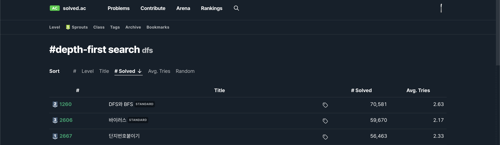
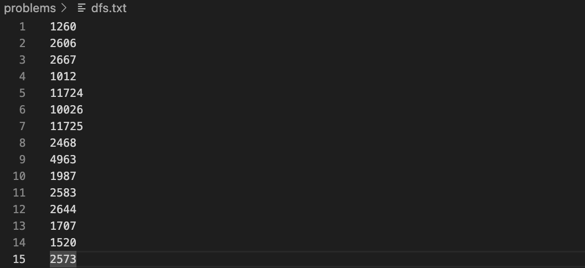
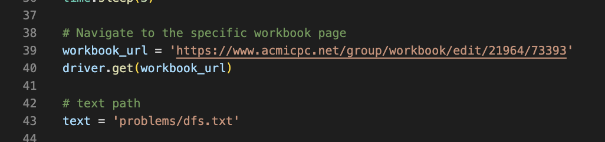

# baekjoon-autolist
Fetches numbers from txt files and automatically places them into a list for 백준 problems.

코딩 테스트 준비를 위해 스터디를 진행하기로 했는데, 백준 문제를 풀면서 문제 번호를 수동으로 리스트에 추가하는 것이 귀찮아서 만들었습니다.

## 데모 예시

## 사용법
1. Sort by # Solved로 정렬 한 뒤, 문제 번호를 갖고 온다.

2. 번호들을 txt 파일에 저장한다.

3. baek.py에 리스트 링크와 .env에 계정 정보를 수정하여 실행한다.

4. 문제들 모두 리스트에 추가 완료!